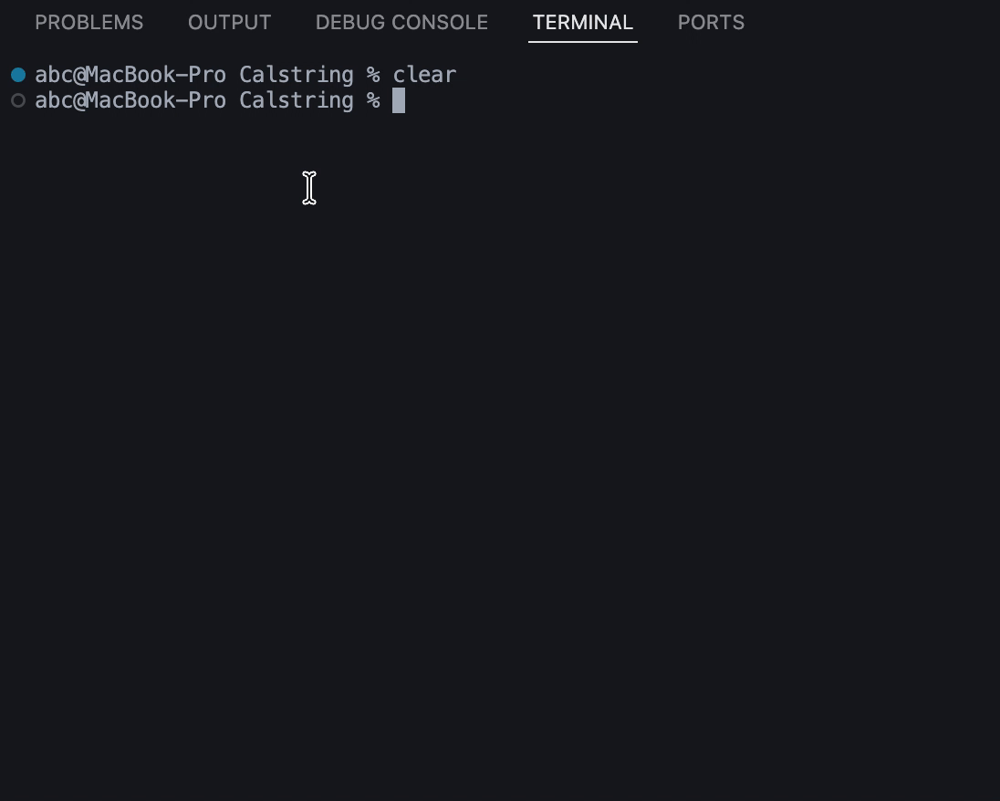

# Calstring

Simple Math Expression Calculator 🧮
This is a beginner-friendly C# console application that calculates simple mathematical expressions consisting of addition (+) and subtraction (-).

<code>Enter a math expression (e.g., 10+5-2):
> 100 + 50 - 20
Result: 130

Do you want to continue? (yes/no):
> yes<code/>

